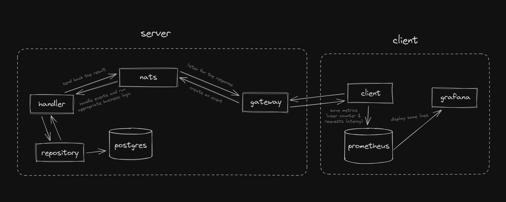
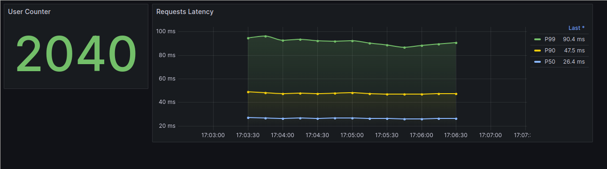

# 🦌


### Таска
Необходимо реализовать транзакционную систему.
Базовый функционал: ввод валюты, вывод валюты, получение баланса (информации) по каждой валюте для отдельного юзера. Юзер не может вывести средства или получить баланс другого юзера. Баланс не может уйти ниже 0.

Обязательно необходимо использовать любой брокер сообщений. В базе должна быть таблица с валютами и должно быть минимум 3 различные валюты.

Проверить работоспособность системы используя сторонний сервис, который будет делать 100 различных запросов в секунду.


### Вступление
С самого начала у меня была мысль использовать кафку в виде message-broker'a, но она никак не укладывалась в общую картину, все-таки запихнуть такое production grade решение в маленький тестовый проект больно. Спустя достаточно большое количество боли я вспомнил про NATS, да, это не совсем то, но я надеюсь, что в данном сценарии он подойдет.

### Чего тут нет
Я не стал запариваться со сложной системой логирования, поднимать дополнительно Loki и еще один дашборд было бы через чур. Клиент-часть максимально простая, без каких-либо излишеств, понятно, что нужно сделать все надежнее и красивее, но я просто решил не запариваться.

### Что тут есть
Если коротко: на бэке имеем `gateway`, он делает базовую обработку запроса и создает ивент в `nats`, который в свою очередь запускает нужный `handler`, основываясь на типе ивента, `handler` в свою очередь получает данные из `repository`, обрабатывает и возвращает запрос назад. Клиент же просто начинает спамить данными по одному сценарию, который можно при желании легко поменять, метрики по запросам текут в `prometheus`, откуда их хапает `grafana`. Ниже есть кривая схема всей "архитектуры" и красивый скриншотик из графаны, просто чтобы был.



### Как его завести
Сначала поднимаем бэк
```
cd backend
docker-compose up --build -d
```
Затем клиент
```
cd ../client
docker-compose up --build -d
```
И бежим в графану, которая находится на `http://localhost:3000` смотреть, что там происходит (дашборд может не обновляться автоматически).

### P.S
Решение далеко не идеальное, несколько раз все переделывал, потому что хотелось получить идеальный результат, но в итоге вышло что-то между. Еще раз обусловлю, что в продакшен я бы лить такое не стал).

🦌
